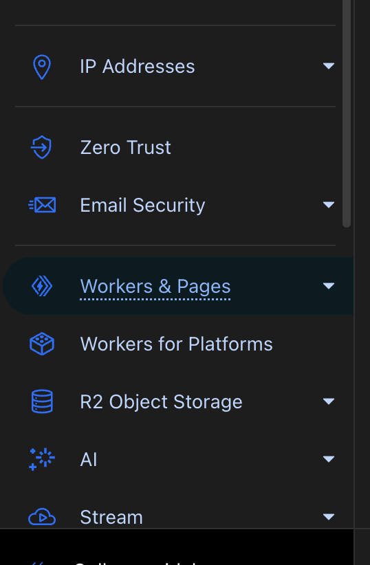
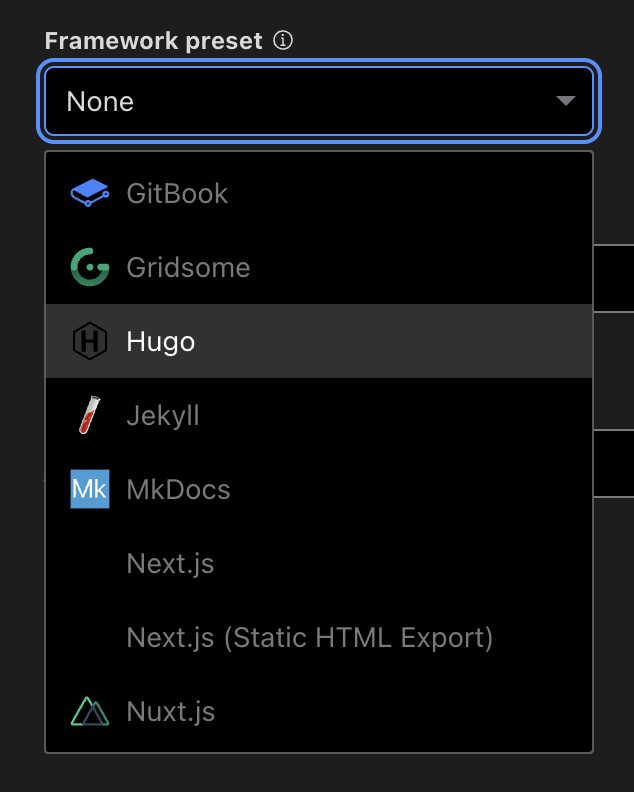

+++
title = 'How I set up my blog (and how you can too)'
date = 2024-09-30T01:47:07-04:00
draft = true
+++

Welcome to my first post on my shiny new blog! In this post, I'll walk you through the process of setting up my blog and website setup. Among the things you will find in my guided tutorial are the tools and technologies I used, the reasons behind my choices, and the step-by-step instructions on how you can set up a similar blog for yourself to suit your needs!

# The stack
My blog was created with an open-source static site generator called [Hugo](https://gohugo.io). Hugo is known for its speed and flexibility making it a great choice for my blog. 

There are other static site generators like Jekyll, and there are even easier, beginner-friendly tools that you can to host your blog like WordPress or Wix, but using Hugo offers several advantages. 

## It's *fast*
Hugo is known for it's speed. This is because it's built in the Go programming language, which offers several features like memory safety and efficiency. While this advantage isn't particularly visible at first glance, it's useful for frequent deployments and scalability if your project gets large.
## It's *powerful*
Hugo blog posts are written in markdown. It's the same language that powers the [Obsidian](https://obsidian.md/) note taking tool, and the same language that is used to create README.md files on GitHub. Markdown lets you can format text quickly, and it's fairly easy to learn.
## It's *customizable*
Hugo offers a lot of flexibility when it comes to flexibility, you have a [variety of themes](https://themes.gohugo.io/) to choose from

For the theme, I chose to go with the [hugo-blog-awesome](https://github.com/hugo-sid/hugo-blog-awesome) theme.

# Cloudflare pages
Recently I transition from GitHub pages to Cloudflare pages, but ultimately I settled on Cloudflare pages for a variety of reasons:

1. It's integrated with the rest of my Cloudflare stack which I'm already using
2. Performance in theory could be slightly better since the site is hosted on the Cloudflare network
3. It's free

With this in mind, it makes the most sense for me to use Cloudflare pages in my setup. We'll be using this for our tutorial today, but Cloudflare pages is just one fish in the pond. If Cloudflare Pages doesn't suit your needs, there are several other platforms you can use. Here are a few alternatives:

1. [GitHub Pages](https://pages.github.com/)
2. [Vercel](https://vercel.com/)
3. [Netlify](https://www.netlify.com/)

# Tutorial
## Step 1: Hugo Installation
This is platform specific, you can refer to the [installation guide](https://gohugo.io/getting-started/installing/) for installing on your OS.
## Step 2: Create hugo site
```bash
hugo new site my-blog
```
## Step 3: Installing Theme
We'll be using hugo-blog-awesome for this example
```bash
cd my-blog
git init
git submodule add https://github.com/hugo-sid/hugo-blog-awesome.git themes/hugo-blog-awesome
```
Add this to your hugo.toml
```bash
theme = "hugo-blog-awesome"
```
You'll see a bunch of other settings here that you can customize to your liking. Find an example hugo.toml [here](https://github.com/hugo-sid/hugo-blog-awesome/blob/main/exampleSite/hugo.toml)
## Step 4: Upload to GitHub
Let's get the files uploaded to your GitHub repository.

Go to GitHub and create a new **empty** repository.

Add the origin link, commit your changes, and push.
```bash
git branch -M main # select branch
git add * # add all files
git commit -m "Upload Files" # commit your changes
git remote add origin https://github.com/yourusername/my-blog.git # replace with your repository URL
git push -u origin main # push to branch
```

## Step 5: Set up Cloudflare pages deployment
Assuming you already have Cloudflare, go to the [Cloudflare dashboard](https://dash.cloudflare.com/). Select "Workers & Pages" from the left side.

In the 'overview' page click the "Create" button and select the "Pages" tab. Since we're connecting this to a GitHub repository, we'll select "Connect to Git."

Follow the steps to connect your GitHub account and select the repository that your hugo blog is located in. Select your repository and click "begin setup."

Under "Framework preset" select "Hugo" as your framework.


Click "Save and Deploy!" 

## Step 6: Set up custom domain link
You can either have your blog at the root of your domain, or you can have it as a subdomain. The process goes as follows:

- From the "Workers & Pages" section on the Cloudflare dashboard, click the name of your repository
- Click "Custom domains"
- Click "Set up a custom domain"

Follow the process to set up your blog with your custom domain. Cloudflare will automate creating the DNS records for you. Once you're done, your site should be deployed the domain you choose!

## Step 7: Make your first post
To make your first post, type the following into your terminal:
```bash
hugo new posts/your-first-post.md
```

You can then open your file in the "posts" folder with your favorite text editor, and use markdown to format and create your first blog post. When you're done, save the file, and remove the "draft = true" line from the top of your .md file.

You can run a local server to preview your site with
```bash
hugo server
```

Once everything looks good, commit and push your changes:
```bash
git commit -m "Create my first blog post"
git push
```

Congratulations! You've just created your first blog! 🥳🎉

# Check out my repo
Feel free to check out the code for this blog on [GitHub](https://github.com/dylankrish/dylankrish-blog)!

# Conclusion
To conclude this post, Hugo is a very powerful tool for developers looking to start a blog. It's Markdown support for blog posts, along with its extensive customization and theming options, makes it an excellent choice. If you're someone who's already used to Markdown or you're a developer looking for an easy way to create a blog, I highly recommend that you give this a try.

Thanks for visiting my blog and reading my post! If you made it this far, you rock! 👊😁